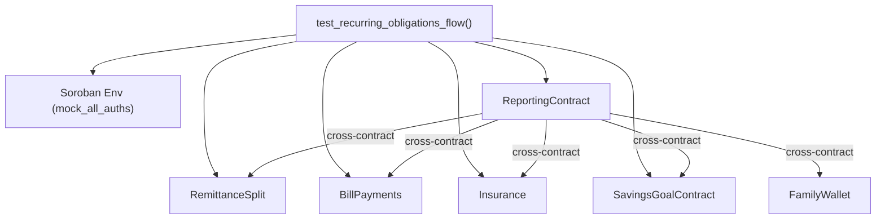

# Design Document: Scenarios – Recurring Obligations

## Overview

This feature implements `test_recurring_obligations_flow`, a deterministic end-to-end integration test in `scenarios/tests/flow.rs`. The test exercises the full remittance window lifecycle across six Soroban contracts: RemittanceSplit, BillPayments, Insurance, Reporting, SavingsGoalContract, and FamilyWallet.

The scenario is structured as a linear sequence of phases:

1. Environment and contract initialization
2. Remittance split configuration
3. Recurring bill creation
4. Insurance policy creation and premium payment
5. Ledger time advancement (simulating billing cycles)
6. Bill payment and recurring cycle verification
7. Financial health report verification

The test must be deterministic (no external state, no randomness), isolated (single shared `Env`), and achieve ≥ 95% line coverage of the `scenarios` crate.

---

## Architecture

The scenario lives entirely within the Soroban test harness. All contracts are registered in a single `Env` instance via `env.register_contract(None, ...)`. Cross-contract calls flow through the Reporting contract's client, which in turn calls BillPayments, Insurance, SavingsGoals, and RemittanceSplit via their generated `*Client` types.



The test drives all contracts directly via their clients. The Reporting contract is the only one that makes cross-contract calls; all other contracts are called directly from the test.

---

## Components and Interfaces

### Contracts Used

| Contract            | Client Type                                    | Key Methods Called                                                                                 |
| ------------------- | ---------------------------------------------- | -------------------------------------------------------------------------------------------------- |
| RemittanceSplit     | `RemittanceSplitClient`                        | `initialize_split`, `calculate_split`, `get_config`                                                |
| BillPayments        | `BillPaymentsClient`                           | `create_bill`, `get_bill`, `pay_bill`, `get_unpaid_bills`, `get_overdue_bills`, `get_total_unpaid` |
| Insurance           | `InsuranceClient` (via `insurance::Insurance`) | `create_policy`, `get_policy`, `pay_premium`, `get_total_monthly_premium`                          |
| SavingsGoalContract | `SavingsGoalContractClient`                    | `create_goal`                                                                                      |
| ReportingContract   | `ReportingContractClient`                      | `init`, `configure_addresses`, `get_financial_health_report`                                       |
| FamilyWallet        | registered only                                | (no direct calls; address passed to Reporting)                                                     |

### Ledger Time Advancement

Time is advanced by mutating `env.ledger().set(LedgerInfo { timestamp: ..., ... })`. All other `LedgerInfo` fields (protocol_version, network_id, base_reserve, min_temp_entry_ttl, min_persistent_entry_ttl, max_entry_ttl) are preserved from the initial `setup_env()` configuration.

### Test Function Signature

```rust
#[test]
fn test_recurring_obligations_flow() { ... }
```

Located in `scenarios/tests/flow.rs`.

---

## Data Models

### Key Types (from contract crates)

**Bill** (`bill_payments::Bill`)

```rust
pub struct Bill {
    pub id: u32,
    pub owner: Address,
    pub name: String,
    pub amount: i128,
    pub due_date: u64,
    pub recurring: bool,
    pub frequency_days: u32,
    pub paid: bool,
    pub created_at: u64,
    pub paid_at: Option<u64>,
    pub currency: String,
    // ...
}
```

**InsurancePolicy** (`insurance::InsurancePolicy`)

```rust
pub struct InsurancePolicy {
    pub id: u32,
    pub owner: Address,
    pub name: String,
    pub coverage_type: CoverageType,
    pub monthly_premium: i128,
    pub coverage_amount: i128,
    pub active: bool,
    pub next_payment_date: u64,
    // ...
}
```

**SplitConfig** (`remittance_split::SplitConfig`)

```rust
pub struct SplitConfig {
    pub owner: Address,
    pub spending_percent: u32,
    pub savings_percent: u32,
    pub bills_percent: u32,
    pub insurance_percent: u32,
    pub initialized: bool,
    // ...
}
```

**FinancialHealthReport** (`reporting::FinancialHealthReport`)

```rust
pub struct FinancialHealthReport {
    pub health_score: HealthScore,       // score: u32
    pub bill_compliance: BillComplianceReport,  // total_bills: u32
    pub insurance_report: InsuranceReport,      // active_policies: u32
    pub savings_report: SavingsReport,
    pub remittance_summary: RemittanceSummary,
    pub generated_at: u64,
}
```

### Scenario-Local State

The test tracks the following local variables across phases:

| Variable                 | Type      | Purpose                                  |
| ------------------------ | --------- | ---------------------------------------- |
| `timestamp`              | `u64`     | Initial ledger time (1704067200)         |
| `user`                   | `Address` | Test user address                        |
| `admin`                  | `Address` | Reporting admin address                  |
| `bill_id_1`, `bill_id_2` | `u32`     | IDs of the two recurring bills           |
| `policy_id`              | `u32`     | ID of the insurance policy               |
| `total_remittance`       | `i128`    | Total remittance amount for split/report |

---

## Correctness Properties

_A property is a characteristic or behavior that should hold true across all valid executions of a system — essentially, a formal statement about what the system should do. Properties serve as the bridge between human-readable specifications and machine-verifiable correctness guarantees._

### Property 1: Split allocation invariant

_For any_ positive total remittance amount and any valid split configuration (four percentages each in [0,100] summing to 100), the sum of all values returned by `calculate_split` must equal the total remittance amount.

**Validates: Requirements 2.4, 2.5**

### Property 2: Invalid percentages rejected

_For any_ combination of four percentages that do not sum to exactly 100 (or where any individual value exceeds 100), `initialize_split` must return `RemittanceSplitError::InvalidPercentages`.

**Validates: Requirements 2.3**

### Property 3: Bill creation produces retrievable unpaid bill

_For any_ valid bill parameters (`amount > 0`, `due_date > current_time`, `recurring = true`, `frequency_days > 0`), calling `create_bill` must return a unique ID, `get_bill(id)` must return a bill with `paid = false`, and the bill must appear in `get_unpaid_bills` for the owner.

**Validates: Requirements 3.1, 3.3, 3.5**

### Property 4: Invalid due date rejected

_For any_ `due_date` strictly less than the current ledger timestamp, `create_bill` must return `BillPaymentsError::InvalidDueDate`.

**Validates: Requirements 3.4**

### Property 5: Overdue detection correctness

_For any_ bill, after advancing ledger time: if `bill.due_date < current_ledger_time` and `bill.paid = false`, the bill must appear in `get_overdue_bills`; if `bill.due_date >= current_ledger_time`, the bill must not appear in `get_overdue_bills`.

**Validates: Requirements 5.2, 5.3, 5.4**

### Property 6: Recurring bill round-trip scheduling

_For any_ recurring bill that is paid via `pay_bill`, the original bill must have `paid = true` and a new unpaid bill must exist with `due_date = original_due_date + frequency_days * 86400`, preserving the original bill's `name`, `amount`, `frequency_days`, and `currency`.

**Validates: Requirements 6.1, 6.2, 6.3, 6.5, 6.6**

### Property 7: Unpaid count non-decrease for recurring bills

_For any_ owner with N unpaid bills where all bills are recurring, after paying one bill the count of unpaid bills for that owner must be >= N (the paid bill is replaced by the next-cycle bill).

**Validates: Requirements 6.4**

### Property 8: Insurance premium payment sets next_payment_date

_For any_ active insurance policy owned by the caller, calling `pay_premium` at ledger time T must return `true` and set `policy.next_payment_date` to exactly `T + 30 * 86400`.

**Validates: Requirements 4.3, 4.4, 8.3**

### Property 9: Policy creation produces active policy

_For any_ valid policy parameters, `create_policy` must return a unique ID and `get_policy(id)` must return a policy with `active = true`.

**Validates: Requirements 4.1, 4.2**

### Property 10: Total monthly premium equals sum of active premiums

_For any_ owner with a set of active policies, `get_total_monthly_premium` must equal the sum of `monthly_premium` across all active policies for that owner.

**Validates: Requirements 4.6**

### Property 11: Bill paid_at equals ledger time at payment

_For any_ unpaid bill, after calling `pay_bill` at ledger time T, `get_bill(id).paid_at` must be `Some(T)`.

**Validates: Requirements 8.2**

### Property 12: Owner isolation

_For any_ two distinct addresses A and B, bills and policies created by A must not appear in `get_unpaid_bills`, `get_active_policies`, or `get_total_monthly_premium` when queried under address B.

**Validates: Requirements 8.5**

### Property 13: Split config round trip

_For any_ valid split configuration `(spending, savings, bills, insurance)` passed to `initialize_split`, the `SplitConfig` retrieved via `get_config` must have matching `spending_percent`, `savings_percent`, `bills_percent`, and `insurance_percent` values.

**Validates: Requirements 8.6**

### Property 14: Health score is non-negative

_For any_ valid scenario state, `FinancialHealthReport.health_score.score` must be a non-negative integer (i.e., `score >= 0`).

**Validates: Requirements 7.3**

---

## Error Handling

| Scenario                                                | Expected Behavior                                                         |
| ------------------------------------------------------- | ------------------------------------------------------------------------- |
| `initialize_split` with percentages not summing to 100  | Returns `RemittanceSplitError::InvalidPercentages`; test must not proceed |
| `create_bill` with `due_date < current_ledger_time`     | Returns `BillPaymentsError::InvalidDueDate`; test must not proceed        |
| `pay_premium` on non-existent policy ID                 | Returns `false`; test asserts this outcome (Requirement 4.5)              |
| `reporting.init` or `configure_addresses` returns error | Test panics with descriptive message                                      |
| Any unexpected `Err` from contract calls                | Test panics immediately (Requirement 8.1)                                 |

All `unwrap()` calls in the scenario must be accompanied by a comment explaining why the value is guaranteed to be `Some` or `Ok`.

---

## Testing Strategy

### Dual Testing Approach

The scenario itself is an integration test. In addition, correctness properties are validated via property-based tests.

**Unit / integration tests** (in `scenarios/tests/flow.rs`):

- `test_recurring_obligations_flow`: the primary scenario, covering all 9 requirements end-to-end
- Specific assertions for edge cases: non-existent policy premium payment, overdue detection boundary, owner isolation

**Property-based tests** (in `scenarios/tests/flow.rs` or a companion `scenarios/tests/properties.rs`):

- Each correctness property above is implemented as a single property-based test
- Library: `proptest` (already available in the Rust ecosystem; add to `[dev-dependencies]` in `scenarios/Cargo.toml`)
- Minimum 100 iterations per property test

### Property Test Tags

Each property test must include a comment in the following format:

```
// Feature: scenarios-recurring-obligations, Property N: <property_text>
```

### Coverage

- Target: ≥ 95% line coverage of the `scenarios` crate
- Measured via `cargo tarpaulin -p scenarios`
- The scenario must be runnable via `cargo test -p scenarios -- --nocapture` without external network access

### Test Phases and Assertions Summary

| Phase           | Key Assertions                                                                                      |
| --------------- | --------------------------------------------------------------------------------------------------- |
| Initialization  | All contracts registered; `reporting.init` and `configure_addresses` succeed                        |
| Split config    | `initialize_split` returns `Ok(true)`; `get_config` matches input; `calculate_split` sum == total   |
| Bill creation   | Two bills created; each has `paid = false`; both in `get_unpaid_bills`                              |
| Policy creation | Policy has `active = true`; `get_total_monthly_premium` == premium                                  |
| Premium payment | `pay_premium` returns `true`; `next_payment_date == ledger_time + 30*86400`                         |
| Time advance    | Bills with `due_date < new_time` appear in `get_overdue_bills`                                      |
| Bill payment    | Original bill `paid = true`, `paid_at == ledger_time`; new bill has correct `due_date`              |
| Report          | `total_bills >= 2`; `active_policies >= 1`; `health_score.score >= 0`; `period_start <= period_end` |
| Owner isolation | Querying under different address returns no bills/policies                                          |
